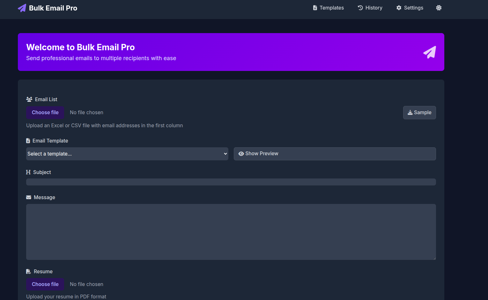
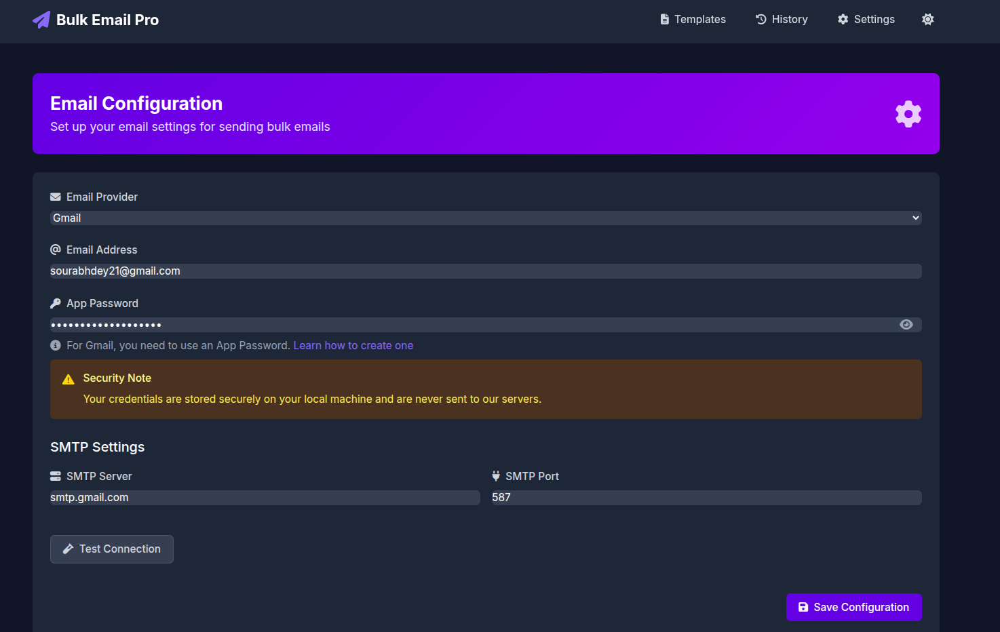

# Bulk Email Sender

A modern web application for sending bulk emails with resume attachments. Built with Flask and featuring a clean, responsive UI.

## Screenshots

### Dashboard


### Settings


## Features

- Send bulk emails with resume attachments
- Support for Excel and CSV email lists
- Secure email configuration
- Modern, responsive UI
- Real-time feedback on email sending status
- Built-in professional email templates
- Email sending history
- Dark/light mode toggle
- Docker and Docker Compose support

## Setup

### 1. Local Development

1. **Create a virtual environment and activate it:**
   ```bash
   python -m venv venv
   source venv/bin/activate  # On Windows: venv\Scripts\activate
   ```
2. **Install dependencies:**
   ```bash
   pip install -r requirements.txt
   ```
3. **Configure your email settings:**
   - For Gmail users:
     1. Enable 2-factor authentication in your Google Account
     2. Generate an App Password (Google Account → Security → App Passwords)
     3. Use this App Password in the application
4. **Run the application:**
   ```bash
   python app.py
   ```
5. **Open your browser and navigate to** `http://localhost:5000`

### 2. Using Docker

1. **Build and run with Docker Compose:**
   ```bash
   docker-compose up --build
   ```
2. **The app will be available at** `http://localhost:8000`

### 3. Environment Variables (.env)
You can use a `.env` file to store sensitive configuration. Example:

```
EMAIL_USER=your_email@gmail.com
EMAIL_PASSWORD=your_app_password
EMAIL_SMTP_SERVER=smtp.gmail.com
EMAIL_SMTP_PORT=587
SECRET_KEY=your_secret_key
```

> **Note:** The app currently uses a web form for email config, but you can extend it to load from `.env` using `python-dotenv` if desired.

## Usage

1. First, click on "Settings" in the navigation bar and enter your email settings
2. On the main page:
   - Upload an Excel or CSV file containing email addresses (first column)
   - Select an email template or write your own subject/message
   - Edit as needed
   - Upload your resume (PDF)
   - Click "Send Emails"

## Email List Format

The application expects an Excel or CSV file with email addresses in the first column. Example:

```
email
john@example.com
jane@example.com
```

## Security Notes

- Email credentials are stored locally in `email_config.json` (or can be loaded from `.env`)
- Files are automatically deleted after sending
- The application uses secure SMTP with TLS
- Maximum file upload size is limited to 16MB

## Requirements

- Python 3.7+
- Modern web browser
- Internet connection for email sending
- (Optional) Docker & Docker Compose

## Running with Uvicorn (ASGI)

You can also run the app with Uvicorn for async support:
```bash
uvicorn asgi:asgi_app --host 0.0.0.0 --port 8000 --reload
```

---

**Feel free to open issues or PRs for improvements!** 